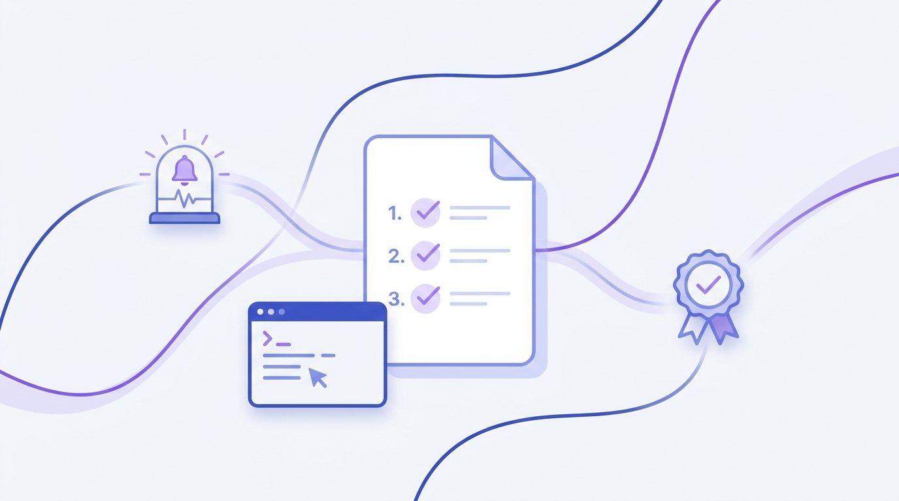

<p align="center">
  
</p>

<h1 align="center">AutoRunbook — AI Runbook Generator</h1>

<p align="center">
  Turn incidents, PowerShell scripts, logs, tickets, monitoring alerts, emails and change
  requests into versioned, approvable operational runbooks — grounded in <em>your</em>
  knowledge base with RAG.
</p>

<p align="center">
  <a href="LICENSE"></a>
  
  
</p>

---

## What it does

Paste any operational material — an **incident report**, a **PowerShell script**, a **log
excerpt**, a **ticket**, a **monitoring alert**, an **email thread**, or a **change
request** — and AutoRunbook generates a complete runbook:

| Section | What you get |
|---|---|
| **Step-by-step procedure** | Numbered, copy-pasteable commands with decision points |
| **Rollback procedure** | How to return to the pre-change state, and when to trigger it |
| **Validation checklist** | `- [ ]` checkboxes proving the system is healthy |
| **Communication templates** | Ready-to-send initial / update / resolution notices |
| **Executive summary** | Plain-language impact & remediation for leadership |

Every runbook is **fully editable** (section-by-section markdown editor with live
preview), **versioned** (every save is a new immutable version; any old version can be
restored), and governed by an **approval workflow**
(draft → in review → approved / rejected / changes requested, with a full audit trail).

Exports: **Markdown**, **styled HTML**, and **PDF** (rendered server-side, no headless
browser needed).

## RAG — grounded in your environment

Documents you add to the **Knowledge Base** (past postmortems, KB articles, alert
definitions, change runsheets…) are chunked and indexed. At generation time the most
relevant passages are retrieved with **BM25** and injected into the prompt, so runbooks
cite *your* servers, *your* tools and *your* conventions — with inline source citations
(`[S1]`, `[S2]`) and per-runbook provenance. The retriever is fully self-contained (SQLite +
Okapi BM25, no vector service); swap in an embedding store by replacing `retrieve()` in
[`src/lib/rag.ts`](src/lib/rag.ts) if you need semantic recall over huge corpora.

## Quick start

```bash
git clone https://github.com/omrzk/autorunbook.git
cd autorunbook
npm install
cp .env.example .env        # add ANTHROPIC_API_KEY (or OPENROUTER_API_KEY)
npm run seed                # optional: sample knowledge-base content
npm run dev                 # http://localhost:3040
```

No API key handy? Set `AUTORUNBOOK_MOCK=1` in `.env` to explore the full pipeline
(editing, versioning, approvals, exports) with placeholder generations.

### Configuration

| Variable | Purpose |
|---|---|
| `ANTHROPIC_API_KEY` | Anthropic API key (recommended provider) |
| `OPENROUTER_API_KEY` | Used if no Anthropic key is set |
| `AUTORUNBOOK_MODEL` | Model override (default `claude-sonnet-5`) |
| `AUTORUNBOOK_DB` | SQLite path (default `./data/autorunbook.db`) |
| `AUTORUNBOOK_ACTOR` | Default author/reviewer identity |
| `AUTORUNBOOK_MOCK` | `1` = no-key demo mode |

## Architecture

```
src/
  lib/
    db.ts      SQLite schema (sources, chunks, runbooks, versions, approvals)
    rag.ts     chunking + BM25 retrieval
    ai.ts      Claude / OpenRouter generation + robust JSON parsing
    store.ts   versioning + approval state machine
    export.ts  Markdown / HTML rendering
    pdf.ts     PDF layout engine (PDFKit, markdown-aware)
  app/
    api/       REST endpoints (sources, generate, runbooks, approval, rollback, export)
    …          UI (dashboard, generator, knowledge base, runbook editor)
```

- **Versioning** — versions are immutable; edits and restores append. An edit resets the
  approval status to `draft` by design: a changed runbook must be re-reviewed.
- **Approvals** — a small state machine enforces legal transitions and records every
  action (who, when, note) in an audit trail.
- **Deployment** — single Node process, SQLite storage. Designed to run behind your
  reverse proxy / SSO. `npm run build && npm start`.

## REST API

| Endpoint | Description |
|---|---|
| `GET/POST/DELETE /api/sources` | Knowledge-base CRUD (indexes on ingest) |
| `POST /api/generate` | `{kind, content, instructions?}` → new runbook |
| `GET /api/runbooks` · `GET/PATCH/DELETE /api/runbooks/:id` | List / read (`?version=n`) / edit (new version) / delete |
| `POST /api/runbooks/:id/approval` | `{action, actor, note}` — submit/approve/reject/… |
| `POST /api/runbooks/:id/rollback` | Restore an older version as a new one |
| `GET /api/runbooks/:id/export?format=md\|html\|pdf&version=n` | Export |

## License

[AGPL-3.0](LICENSE) © omrzk. If you run a modified version as a network service, you must
make your modified source available to its users.

---

*Hero illustration generated with Higgsfield.*
